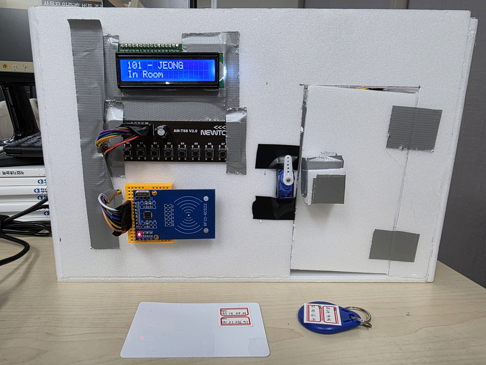
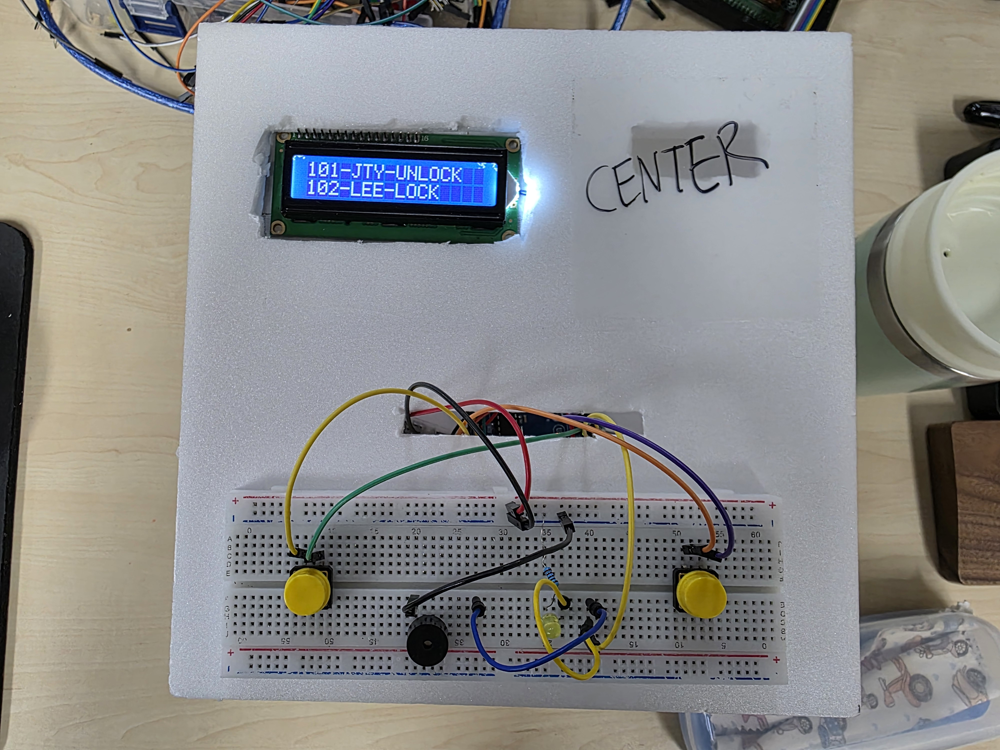

# Office IoT

## 개요
본 시스템은 STM32F411RE 및 Arduino Uno 기반의 임베디드 시스템으로, 사용자의 재실 현황과 침입 감시를 통합 관리한다. RFID 인증, 상태 버튼 입력, BLE 통신, ESP WiFi 통신, 센서 기반 자동 제어 기능을 포함한다. 상태 정보는 MariaDB에 저장되며, TCP 기반의 서버-클라이언트 구조로 동작한다.

|  |  |
| -------------------------------- | -------------------------------- |

## 첨부 자료
https://drive.google.com/drive/folders/14gAR5_BfWPSxsVc7ORA3zlUNE6ZjeE-E?usp=drive_link

## 주요 기능
- MFRC522 모듈을 이용한 RFID 사용자 인증
- 6개의 버튼을 이용한 출입 상태 설정 (IN, LEC, VAC, MTG, BRK, OUT)
- ESP-01을 통한 WiFi 기반 서버 연동
- DHT11(온습도), CDS(조도), PIR(모션) 센서 연동
- 서보 모터 및 DC 모터 기반 도어·커튼 제어
- I2C 기반 CLCD 디스플레이 출력
- Arduino Uno와 BLE 통신을 통해 중앙 관제 시스템 연동
- 침입 감지 시 BLE를 통해 경고 전송 및 비상 시 강제 개방 명령 수신 가능

## 하드웨어 핀 구성

### Arduino Uno

| 인터페이스 | 핀 번호 | 방향   | 설명                |
| ---------- | ------- | ------ | ------------------- |
| I2C SDA    | A4      | InOut  | LCD 데이터 송수신   |
| I2C SCL    | A5      | InOut  | LCD 클럭 송수신     |
| BLE TX     | D6      | Output | BLE 모듈 송신       |
| BLE RX     | D7      | Input  | BLE 모듈 수신       |
| BUZZER     | D8      | Output | 경고음 출력         |
| BUTTON1    | D9      | Input  | 경고 정지 버튼      |
| BUTTON2    | D10     | Input  | 전체 출입 해제 버튼 |

### STM32F411RE

| 인터페이스        | 핀 번호 | 방향           | 설명                                |
| ----------------- | ------- | -------------- | ----------------------------------- |
| DHT11             | PC10    | Input          | 온습도 센서 입력                    |
| BUTTON0~5         | PC0~PC5 | Input          | 재실 상태 선택용 버튼               |
| ESP-RX            | PA12    | Input          | ESP8266에서 STM32로 수신            |
| ESP-TX            | PA11    | Output         | STM32에서 ESP8266으로 송신          |
| RFID-RST          | PB2     | Output         | RC522 리더기 리셋 제어              |
| PIR               | PB1     | Input          | 동작 감지 센서 입력 (EXTI 인터럽트) |
| CDS               | PA0     | Input          | 조도 센서 아날로그 입력             |
| RFID-SDA (NSS)    | PA4     | Output         | SPI1 NSS (Chip Select)              |
| RFID-SCK          | PA5     | Output         | SPI1 클럭                           |
| RFID-MISO         | PA6     | Input          | SPI1 데이터 입력                    |
| RFID-MOSI         | PA7     | Output         | SPI1 데이터 출력                    |
| I2C-SCL / MOTOR_A | PB8     | InOut / Output | LCD 클럭 / 모터 A채널 제어          |
| I2C-SDA / MOTOR_B | PB9     | InOut / Output | LCD 데이터 / 모터 B채널 제어        |
| SERVO_PWM         | PA8     | Output         | 도어락 제어용 서보 PWM 출력         |
| BUZZER            | PB10    | Output         | 경고 부저 출력                      |
| LED               | PC7     | Output         | 출입 상태 LED 표시                  |

## 사용 인터페이스 요약

| 인터페이스 종류 | 사용 용도                              |
| --------------- | -------------------------------------- |
| UART            | ESP8266 (PA11, PA12), BLE (SoftSerial) |
| SPI             | RC522 RFID (PA4~PA7)                   |
| I2C             | CLCD (PB8, PB9), 관제 LCD (A4, A5)     |
| GPIO Input      | 버튼, PIR, DHT                         |
| GPIO Output     | 부저, LED, RFID-RST                    |
| PWM             | 도어 서보 (PA8), 커튼 서보 (PB6, PB9)  |
| ADC             | CDS 조도센서 (PA0)                     |
| EXTI            | PIR 센서 (PB1, EXTI1_IRQn)             |

## 서버 및 클라이언트 구조

### 구성 요소
- `iot_server.c`: TCP 서버. 클라이언트 인증 및 메시지 분배 처리
- `iot_client.c`: 일반 메시지 송수신 클라이언트
- `iot_client_sql.c`: DB 기반 사용자 인증 및 상태 처리 (libmysqlclient 사용)
- `iot_client_bluetooth.c`: BLE 입력 수신 및 서버 전달 클라이언트

### MariaDB 테이블 구조
- `user_info(room_number, user_name, card_hex)`
- `room_status(room, status, door, light)`


## 시스템 동작 흐름

### 1. 시스템 부팅 및 초기화
- STM32 마이크로컨트롤러는 다음 장치들을 순차적으로 초기화
  - ESP-01 WiFi 모듈
  - MFRC522 RFID 리더
  - I2C LCD (CLCD)
  - DHT11 온습도 센서, CDS 조도 센서, PIR 센서 등
- UART 터미널에는 초기화 로그 출력 (ESP 연결 성공 여부, RC522 버전 등)

---

### 2. 사용자 RFID 인증
- 사용자가 RC522에 RFID 카드를 태깅
- 카드 UID 추출 후 `[PRJ_SQL]CERT@ROOM@UID` 메시지를 ESP를 통해 서버로 전송
- 서버의 SQL 클라이언트가 MariaDB에서 UID 인증 처리
- 인증 결과에 따라 다음 동작 수행
  - **성공**: `Success!!` 메시지 LCD에 출력, 버튼 입력 대기 상태 전환
  - **실패**: `Failed!!` 메시지 LCD에 출력 후 재시도 대기
  - **10초 초과**: `Time Over` 메시지 출력, 인증 자동 취소

---

### 3. 출입 상태 설정
- 인증된 사용자는 다음 중 하나의 버튼을 눌러 상태를 선택

| 버튼 번호 | 상태 코드 | 설명 |
| --------- | --------- | ---- |
| BUTTON0   | IN        | 입실 |
| BUTTON1   | LEC       | 수업 |
| BUTTON2   | VAC       | 외출 |
| BUTTON3   | MTG       | 회의 |
| BUTTON4   | BRK       | 휴식 |
| BUTTON5   | OUT       | 퇴실 |

- 선택한 상태는 다음과 같이 반영됨
  - LCD 상단: 방 번호 + 사용자 이름 출력
  - LCD 하단: 선택된 상태 문자열 출력
  - 서버로 `[PRJ_SQL]SETROOM@ROOM@STATUS` 메시지 전송
  - `IN` 선택 시: 도어 Unlock (서보 작동), 상태 LED On
  - 그 외 상태 선택 시: 도어 Lock, 상태 LED Off

---

### 4. 센서 기반 자동 제어 (IN 상태 한정)
- `IN` 상태에서만 아래 제어 루틴 활성화
  - **DHT11 센서 (온습도)**  
    - 온도 > 30℃ 또는 습도 ≥ 60%: 팬 작동 (PB13, PB14, PB15 제어)
  - **CDS 센서 (조도)**  
    - 밝기 낮음: 커튼 열림 (DC 모터 제어)  
    - 밝기 높음: 커튼 닫힘
- 주기: 5초 간격으로 자동 측정 및 반응 수행

---

### 5. 침입 감지 및 중앙 전송
- 현재 상태가 `IN`이 아닌 경우:
  - PIR 센서(PB1)가 움직임 감지 시
    - UART 로그: `"움직임 감지됨"` 출력
    - ESP를 통해 `[PRJ_CEN]DETECTED@ROOM` 메시지 전송
- BLE 기반 중앙 관제 시스템으로 실시간 전달됨

---

### 6. 중앙 관제 시스템의 BLE 통신
- 수신 시 시스템은 다음과 같이 반응함:
  - LCD 상태 즉시 반영
  - 도어 제어 및 LED 상태 동기화
  - 서버로 상태 동기화 메시지 송신

---

### 7. 상태 유지 및 재진입 처리
- 상태는 명시적 변경 전까지 유지됨
- 사용자는 다시 카드 태깅 후 동일 인증 절차 수행 가능
- 센서 이벤트 및 BLE 통신은 상태 전환과 무관하게 지속 활성화됨

## 빌드 방법

### STM32 (STM32CubeIDE)
- 프로젝트 열기 → Build 버튼 클릭

### Linux 서버 측 (gcc 사용)
```bash
gcc -o server iot_server.c -lpthread
gcc -o client iot_client.c -lpthread
gcc -o sql_client iot_client_sql.c -lpthread -lmysqlclient
gcc -o bt_client iot_client_bluetooth.c -lpthread -lbluetooth
```


